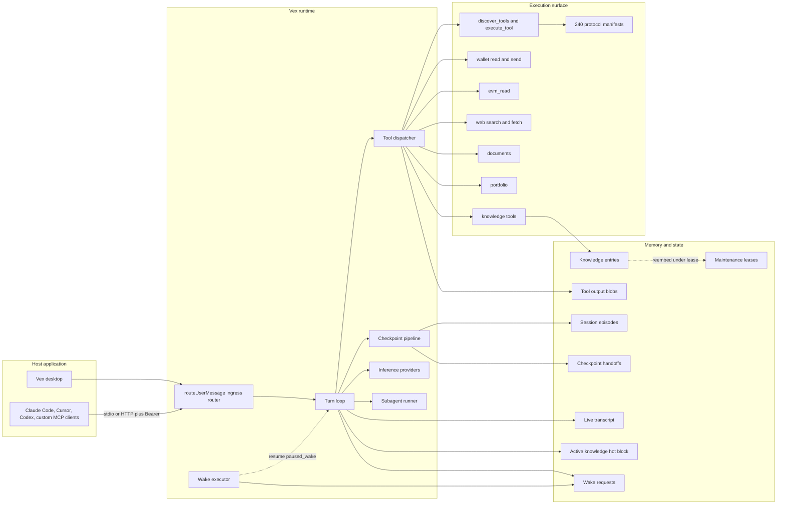
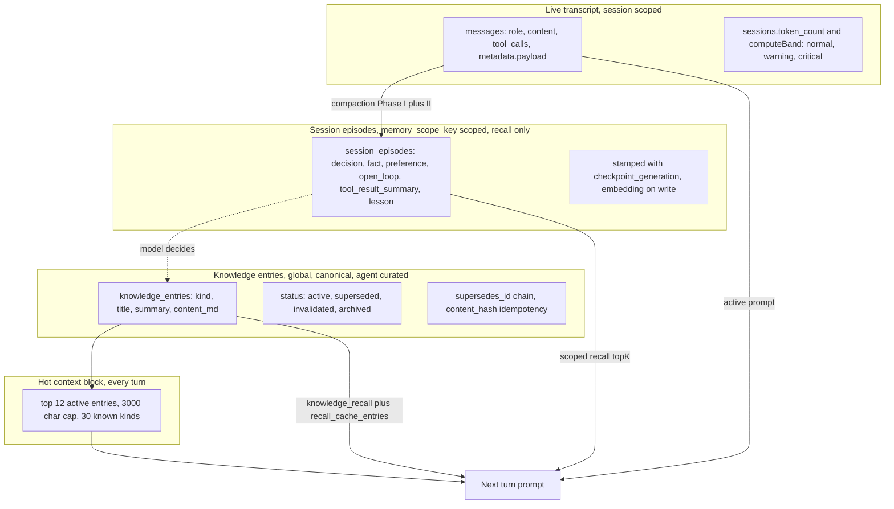
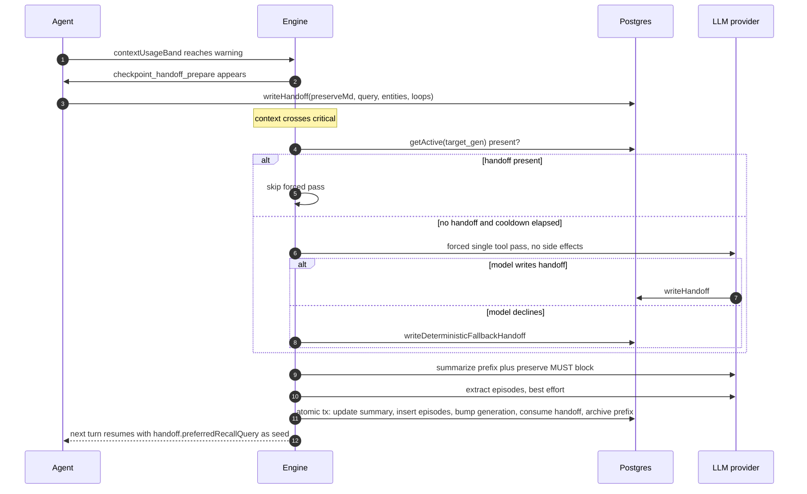
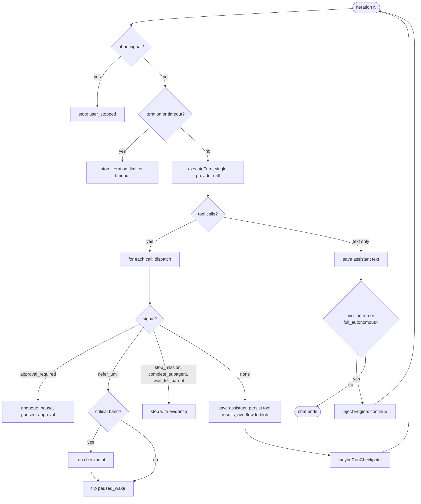
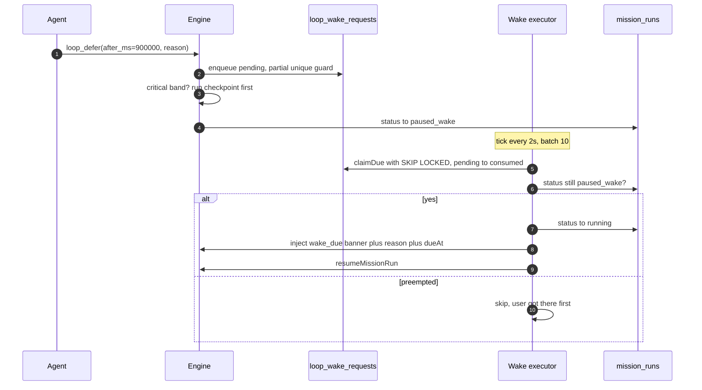
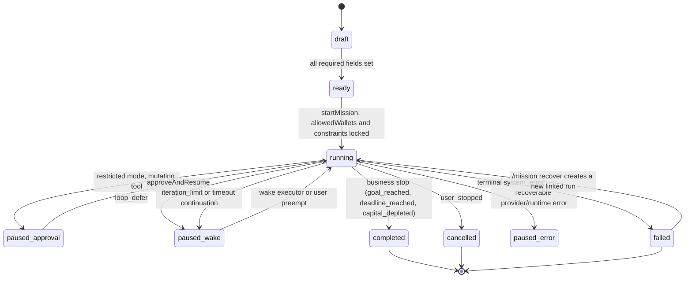
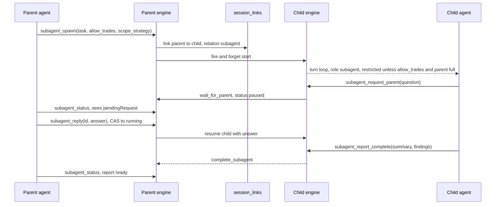
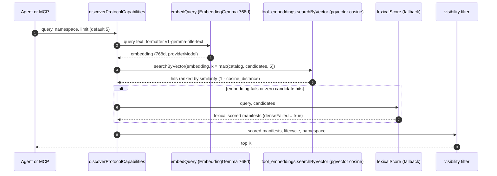
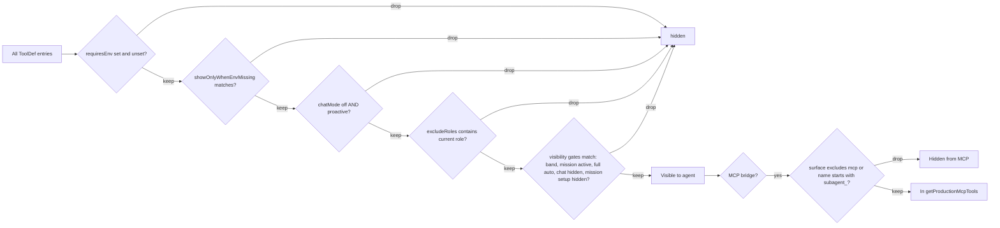
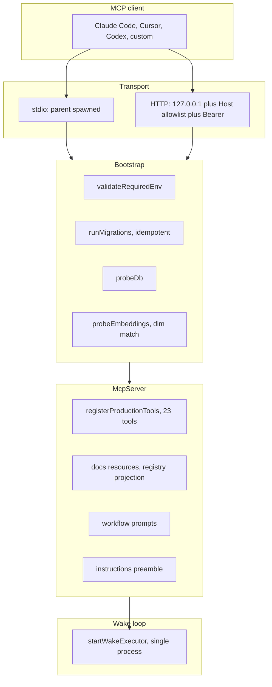

<div align="center">

# Vex

**A memory-first autonomous agent platform for on-chain execution.**

Two products, one engine. A desktop agent that plans, remembers, and trades on its own, and a Model Context Protocol bridge that lets any compliant host (Claude Code, Cursor, Codex, or a custom client) drive the same stack from the outside.

[Why Vex](#why-vex) · [Architecture](#architecture-at-a-glance) · [Memory](#memory-first-architecture) · [Autonomy](#autonomy-missions-wake-loops-subagents) · [Tool ecosystem](#tool-ecosystem) · [MCP bridge](#mcp-bridge) · [Operations](#operations) · [Roadmap](#roadmap) · [Distribution](#distribution)

</div>


---

## What it is

Vex is a production grade agent runtime built around three axes that most LLM stacks leave as an afterthought.

1. **Canonical memory with disjoint contracts.** Knowledge the agent writes by hand is the source of truth. Session episodes are scoped recall helpers. Live transcripts compact themselves under pressure. The three layers never cross contaminate, and every compaction preserves a handoff so the next turn picks up where the previous one left off.
2. **Wake driven autonomy, preempt symmetric.** The agent can pause itself until a future moment, be interrupted by a user in flight, or run entirely headless. In every case resume is atomic, the wake row is consumed exactly once, and the user message always wins the race.
3. **Tool federation at scale.** A 33 tool agent surface (23 of them visible through MCP in a fully configured environment) federates to **240 protocol manifests** across 10 live on chain and social namespaces. A disciplined filter chain keeps the surface safe whether the operator is a human in a GUI, a remote Claude Code session, or a headless autonomous mission.

The same TypeScript engine (`src/vex-agent/`) powers both products. The MCP bridge (`src/mcp/`) is a passive surface adapter on top. No feature lives only in one product.

---

## Why Vex

Most agent frameworks hand you a loop and a tool schema. Vex hands you an opinionated memory architecture, a pause and resume protocol, and a filter chain that is the same whether the operator is a GUI user or a remote client.

**1. Disjoint memory contracts that the engine actually enforces.** Knowledge entries are written only through agent invoked tools, with a content hash idempotency guarantee. Session episodes are write once, inside the checkpoint transaction. Hot context (the last dozen active entries) is surfaced in every prompt without a tool call. No other agent framework we know of separates these three stores at the schema level.

**2. Continuity across compaction, not just summarization.** When context usage crosses 80% the agent gets a one shot tool to write a structured handoff (preserve block, preferred recall query, important entities, open loops). At 90% without a handoff the engine runs a side effect light forced pass with only that tool. If the model still refuses, a deterministic fallback built from recent episodes writes a non empty payload. The post compact turn is never left with a silent recall.

**3. Preempt symmetric autonomy.** A user message and a wake signal are first class peers. The ingress router cancels any pending wake before saving a user message. The wake executor re checks run status and skips resume if the user beat it. The same session state machine handles both.

| Axis | Vex | Typical LangChain agent | AutoGPT style loop | CrewAI | Goose |
|---|---|---|---|---|---|
| Canonical memory layer | Manual only, schema enforced | Free form, vector only | Free form notes | Shared memory, free form | Session based |
| Compaction continuity | Structured handoff with forced pass fallback | Summarizer, no handoff | None, drops context | Limited summary | Conversation summary |
| Multi turn autonomy | Native missions and full autonomous with wake defer | External scheduler | Fixed loop until stop | Crew orchestration, no defer | Per prompt |
| User preemption | First class, cancels pending wake | Not modeled | Not modeled | Not modeled | Natural (no autonomy state) |
| Tool surface scale | 240 protocol manifests, 10 namespaces | User supplied | User supplied | User supplied | User supplied |
| On chain breadth | 40+ EVM chains plus Solana, native | Third party plugins | Third party plugins | Third party plugins | Third party plugins |
| Approval gate | Restricted mode, compare and swap queue | Manual | Manual | Manual | Manual |
| MCP bridge | First party, zero drift projection | Third party adapters | None | None | Yes, different semantics |

---

## Products

| Product | Shape | Audience | Install |
|---|---|---|---|
| **Vex** | Desktop agent for macOS, Windows, and Linux with integrated chat, mission control, and wallet UX. | End users, traders, researchers. | Native application. |
| **Vex MCP** | Local package exposing the engine over Model Context Protocol (stdio and HTTP). | Developers driving Vex from Claude Code, Cursor, Codex, or a custom MCP host. | Installed through the Vex distribution channel, registers the `vex-mcp` binary with the chosen host. |

Both products talk to the same local PostgreSQL with pgvector store, the same knowledge entries, the same live sessions. A mission started from the MCP side is resumable from the Vex desktop app, and a knowledge entry written over MCP appears in desktop recall on the next turn.

---

## Quickstart

### Run Vex (desktop)

1. Install the Vex application for your OS from the Vex distribution channel.
2. On first launch Vex provisions a local PostgreSQL with pgvector instance and generates the HTTP token for the MCP bridge.
3. Open a chat session, or draft a mission from the mission panel. No further setup needed.

### Wire the MCP bridge to a host

1. Install the `@vex/vex` package through the Vex distribution channel. This registers the `vex-mcp` binary on your PATH.
2. Add the server entry to your host configuration. For stdio transport the block is minimal:

   ```json
   {
     "mcpServers": {
       "vex": {
         "command": "vex-mcp",
         "args": []
       }
     }
   }
   ```

3. Restart the host. On initialize, Vex runs migrations, probes the database and the embedding service, then registers its 23 production tools in a fully configured environment. HTTP transport flips `MCP_TRANSPORT=http` and reads the Bearer token from `CONFIG_DIR/mcp-http-token`.

### Migrating from EchoClaw

If you upgraded from a previous EchoClaw install, run `rm -rf ~/.config/echoclaw` and re-run `vex setup`. ENV variables changed (`ECHO_AGENT_DB_URL` to `VEX_DB_URL`, `ECHO_KEYSTORE_PASSWORD` to `VEX_KEYSTORE_PASSWORD`, `ECHO_CONFIG_DIR` to `VEX_CONFIG_DIR`). The Postgres role/database in `docker/vex-agent/` was renamed from `echo_agent` to `vex`. Drop the old volume (`docker volume rm <stack>_echo-agent-db-data`) before bringing up the new compose stack.

---

## Architecture at a glance



One host, one engine, one store. Transport and UI vary, the contract does not.

A key invariant lives in `src/mcp/context.ts`: **the MCP server is not an agent.** It reuses the dispatcher with `loopMode: "full"` and `approved: true`, but those flags are dispatcher gate bypass markers, not autonomy or per call approval. Gate decisions for MCP belong to the host permission UX (Cursor, Claude Code, Codex) and to the transport boundary (stdio process trust, HTTP Bearer token).

---

## Memory first architecture

Every agent platform claims a memory layer. Most glue an embedding index onto a transcript and call it done. Vex treats memory as three disjoint layers, each with a declared purpose, a retention policy, and a write path. On top of that a hot context block is surfaced on every turn, so the agent never has to query for the knowledge it just wrote.

### Three layers, three contracts



| Layer | Store | Write path | Retention | Reader |
|---|---|---|---|---|
| Live transcript | `messages` (and `messages_archive` on fork) | Every turn, every tool result | Until archived by checkpoint | Turn loop, hydrate |
| Session episodes | `session_episodes` | Only the checkpoint write transaction | Forever, pruned via session cascade | Scoped recall during turn, continuity fallback |
| Knowledge entries | `knowledge_entries` (plus `recall_cache_entries` for overflow) | Only agent invoked `knowledge_write` and `knowledge_supersede` | Active by default, TTL or pinned | `knowledge_recall` (active only), hot context block |
| Tool output blobs | `tool_output_blobs` | Turn loop when a tool output exceeds 16 KiB | TTL 15 min, refreshed at every resume path | `tool_output_read`, per session scope guard |
| Checkpoint handoffs | `checkpoint_handoffs` | Warning band tool call or forced pre compact pass | Audit trail (`active` to `consumed` or `superseded`) | Post compact recall seed |
| Wake requests | `loop_wake_requests` | `loop_defer` tool | Until consumed or cancelled | Wake executor |
| Maintenance leases | `maintenance_leases` | Reembed script and any background migration | Held for duration of maintenance op | Writers wait on shared lock |

### Hot context block

On every turn the engine surfaces a compact block of the agent's own knowledge in the prompt, without a tool call. Up to 12 active entries are shown, capped at 3000 characters total, grouped by the 30 most recent `kind` values. Entries are summarized to 200 characters. This is how the agent remembers what it decided yesterday without paying a recall round trip.

### Recall overflow cache

`knowledge_recall` returns up to 10 entries inline, capped at 50000 characters. Anything beyond the cap is written to `recall_cache_entries` with a 15 minute TTL and an opaque `rcl-YYYYMMDD-<hash>` handle. The agent fetches overflow through `knowledge_recall_overflow` when the inline preview is not enough. Cached rows are expired lazily, never blocking on a cleanup.

### Supersede, lineage, history

Knowledge is versioned. `knowledge_supersede` atomically replaces a predecessor entry with a new one, requiring a reason and optionally a change summary and a `what_failed` note. The predecessor is locked during the transaction. Readers can walk the full chain with `knowledge_lineage`, or browse the audit timeline with `knowledge_history`.

### Compaction with continuity

When a session's context usage crosses 80% (the warning band), a dedicated `checkpoint_handoff_prepare` tool appears on the agent's surface. The agent can write one structured handoff per upcoming compaction: a preserve block (up to 2000 chars), a preferred recall query (up to 500 chars), up to 20 important entities, up to 20 open loops.

If context hits 90% (the critical band) without a prepared handoff, the engine runs a **side effect light forced pass**. It calls the provider directly with only that one tool available, no usage logging, no token bookkeeping, no transcript writes. If the model still declines, a deterministic fallback built from the last few episodes writes a non empty payload. The post compact turn is never left with a silent recall.

A per session cooldown (60s) prevents hammering the provider on a stubborn session. The cooldown stamps only after a handoff actually lands, so a double transient failure (provider plus fallback both rejecting) is free to retry immediately rather than getting locked out.



The whole write transaction (rolling summary, episode insert, generation bump, handoff consumption, archive fork) runs as one atomic step under a process local mutex plus a `FOR UPDATE` row lock. Either the whole compaction lands or none of it does. No half applied states.

Checkpoint also carries a noop cooldown (5 min) that throttles back to back attempts when there is nothing useful to compact, so pressure from a stuck conversation never turns into a retry storm.

### Two thresholds, two mechanisms

Vex distinguishes two independent overflow scenarios.

- **Inline 16 KiB cap** applied on the turn loop for every tool result as it is being persisted. Anything over the cap goes to `tool_output_blobs` with a 15 minute TTL, and a stub message carries the `blob_key` and a preview so the transcript stays readable. If the blob write itself fails the engine falls back to inline persist, never dropping, because dropping would break the `tool_call` to `tool_result` pair invariant.
- **Post hoc giant tool fallback** applied during checkpoint. If a single tool message already in the transcript exceeds 8000 characters and was not already externalized, the checkpoint plan forks that one message into the archive under its own placeholder, keeping the pair contract stable. Overflow rows (which are already externalized) are skipped to avoid double archiving.

### Multilingual rolling summary

On the first checkpoint of a session the summarizer infers a memory language code from the prefix, pins it to `sessions.memory_language_code`, and uses it for every subsequent summary. A Polish session stays in Polish, a Japanese session stays in Japanese. Knowledge entries remain English only (see Conventions below), but the scoped episodic layer respects the session's actual language.

### The recall seed no one else has

On every turn the engine resolves the seed query for session episode recall using a five priority ladder. The critical bit: after compaction, the just consumed handoff is still readable (not only `active` rows), so the post compact turn sees the continuity note the previous turn wrote.

| Priority | Condition | Seed source |
|---|---|---|
| 1 | Active or consumed handoff for current generation | `handoff.preferredRecallQuery` |
| 2 | Last engine message was `wake_due` | `reason` plus mission objective plus open loops |
| 3 | Mission or autonomous session with substantial assistant history | last assistant plan plus open loops |
| 4 | Empty full autonomous session | `"Resume autonomous session"` plus top three episode titles |
| 5 | Fallback | last user input |

---

## Autonomy: missions, wake loops, subagents

Vex's runtime is a matrix of session kinds times loop modes, not a single agent loop. Each cell has explicit behavior for what ends the loop, what needs approval, and what tools are visible.

| Session kind | Loop mode | Approval gate | Text ends loop | Tools unique to cell |
|---|---|---|---|---|
| chat | off | mutations only | yes | None |
| mission setup | off | mutations only | yes | Mission patch tools |
| mission run, restricted | restricted | every mutation | no, injects `[Engine: continue]` | `mission_stop`, `loop_defer`, `checkpoint_handoff_prepare` at band |
| mission run, full | full | none | no | Same |
| full autonomous | full | none | no | `loop_defer` always, handoff at band |
| subagent | restricted unless `allowTrades` and parent full | inherited | yes | `subagent_request_parent`, `subagent_report_complete` |

Restricted mode is not a polite nudge. Every mutating tool (wallet sends, protocol executes, Polymarket CLOB orders) returns `pendingApproval: true` and enqueues into `approval_queue` with a compare and swap approve path. The host sees a pause, the human decides, and `approveAndResume` re dispatches the exact same tool call with `approved: true`. The CAS is enforced in SQL (`WHERE id = $1 AND status = 'pending'`), returning null if the approval was already resolved by a concurrent actor.

### Turn loop iteration



Crucial property: the assistant message is only saved after dispatch decides which tool calls to canonicalize. A call that never runs (because an earlier call in the batch paused for approval) is not in the transcript. There are no orphan `tool_call_id` references.

### Wake driven autonomy

A session can suspend itself with `loop_defer(after_ms | wake_at, reason)`, with exactly one pending wake per session enforced at the database level via a partial unique index. The wake executor is a single process polling loop that claims due rows with `SELECT ... FOR UPDATE SKIP LOCKED`, inside a dedicated connection, so concurrent ticks never double fire.



User preemption is symmetric. Every inbound user message runs through a router that cancels any pending wake for the session before touching state. If the run was `paused_wake`, it flips to `running` under a hand off and the user message lands as a first class interrupt, not as a second class interjection behind a bot.

Operator messages during an already running mission or full autonomous loop are soft interrupts. The current provider/tool iteration is allowed to finish, then the turn loop merges any new `operator_interrupt` user messages from the database, injects an internal cue, and the next provider call must acknowledge the latest instruction before continuing. Full autonomous sessions have their own durable `full_autonomous_runs` row so wake executor, user preemption, and manual resume all share the same CAS-style single-loop guard.

### Missions



A mission is not just a prompt. It locks `allowedWallets`, `allowedChains`, `allowedProtocols`, `riskProfile`, `successCriteria`, `stopConditions`, and a capital source with starting capital. An optional deadline bounds the whole run. `mission_stop` is the only terminal business stop and is gated to active runs (`missionRunId != null`). The MCP bridge hides it entirely, because mission state is an engine side concept the host cannot drive.

Every mission run stores a frozen contract snapshot. A terminal `failed` run is immutable audit history; `/mission recover` creates a new run linked back to the failed run and reuses that snapshot instead of mutating the failed row in place.

### Subagents



Subagents default to **isolated memory scope**, their own `memory_scope_key` so their episodes do not leak into the parent's recall. They can also run `shared` (inheriting the parent's scope). Isolation is per level and non transitive: a grandchild inherits its direct parent's scope decision, not the root's. Child only tools (`subagent_request_parent`, `subagent_report_complete`) are hard blocked for parents; parent only tools (`subagent_spawn`, `subagent_status`, `subagent_stop`, `subagent_reply`) are hard blocked for children. Blocks sit at both registration (visibility) and dispatch (defense in depth).

The `session_links` table is a general graph. It stores subagent relationships today but the relation type field is open, anticipating loop and handoff relations from a shared graph primitive.

---

## Tool ecosystem

Vex's surface is intentionally small at the agent level and deep underneath.

- **33 agent level tools** register in the engine.
- **23 of those** are visible through the MCP bridge in a fully configured environment. The exact number dips if `TAVILY_API_KEY` is unset (hides `web_research`) or `RETTIWT_API_KEY` is unset (hides `twitter_account`), and rises by one if `POLYMARKET_API_KEY` is unset (shows `polymarket_setup` for one shot credential provisioning).
- **140 protocol manifests** federate through two meta tools, `discover_tools` for semantic search and `execute_tool` for typed dispatch by `toolId`.
- **40+ EVM chains plus Solana** are resolved dynamically from the Khalani chain registry at call time. There is no hardcoded chain list to rot.

### Protocol namespaces

Five protocol namespaces are live in code and reachable through `discover_tools`.

| Namespace | Tools | Mutating | Read only | Gated by | Role |
|---|---:|---:|---:|---|---|
| `solana` | 20 | 7 | 13 | `JUPITER_API_KEY` | Jupiter swap, lending, prediction markets |
| `polymarket` | 79 | 9 | 70 | `POLYMARKET_API_KEY` (CLOB plus auth reads) | Gamma events, CLOB orderbook and trading, bridge, rewards, data |
| `kyberswap` | 21 | 11 | 10 | None | EVM swap, zap, limit orders, chain and token registry |
| `khalani` | 9 | 1 | 8 | None | Cross chain bridge plus canonical token and chain registry |
| `dexscreener` | 11 | 0 | 11 | None | Market research, trending, paid order verification |

**Totals: 140 manifests across 5 live namespaces, 28 mutating, 112 read only.**

### Agent level tools (non protocol)

| Tool | Purpose | Mutating | Notes |
|---|---|---|---|
| `discover_tools` | Semantic search over protocol manifests | No | English only query, filters by availability (lifecycle and env) |
| `execute_tool` | Typed dispatch to a protocol manifest | Inherits | Mutations approval gated in restricted mode |
| `wallet_read` | Live balances for configured Vex wallets | No | EIP 155 plus Solana, chain filters resolved through Khalani |
| `khalani_chains_list`, `khalani_tokens_top`, `khalani_tokens_search`, `khalani_tokens_balances` | Direct Khalani read aliases | No | Shortcuts for common chain/token/balance reads; other Khalani tools stay behind discovery |
| `wallet_send_prepare` | Prepare a native, ERC 20, ERC 721, or SPL send | No | Returns an intent id |
| `wallet_send_confirm` | Broadcast the prepared intent | Yes | Approval gated in restricted mode |
| `evm_read` | Receipts, metadata, balances | No | Any EVM chain in the Khalani registry |
| `web_research` | Tavily backed search + page fetch (one tool) | No | Hidden unless `TAVILY_API_KEY` set |
| `twitter_account` | Rettiwt backed read-only Twitter/X account research | No | Hidden unless `RETTIWT_API_KEY` set; use a secondary account |
| `document_read`, `document_write`, `document_list`, `document_delete` | Scratchpad notes in the `notes` space | Mixed | Persisted in the database, soft delete |
| `portfolio_inspect` | Portfolio views (see below) | No | Filters by namespace, product type, instrument key, wallet address, status, groupBy |
| `knowledge_write` | Create a new canonical entry | Yes | English only, content hash idempotent |
| `knowledge_supersede` | Atomically replace an entry with a new version | Yes | Requires predecessor id and reason, optional change summary and what_failed |
| `knowledge_recall` | Embedding search over active entries | No | Inline cap 10 entries or 50000 chars, overflow goes to cache |
| `knowledge_recall_overflow` | Read a cached recall overflow bundle | No | 15 minute TTL |
| `knowledge_get` | Read one entry by id | No | |
| `knowledge_update_status` | Move to `invalidated` or `archived` | Yes | One way transition |
| `knowledge_lineage` | Walk the `supersedes_id` chain | No | |
| `knowledge_history` | Audit timeline for an entry | No | |
| `polymarket_setup` | One shot derive and save Polymarket CLOB creds | Yes | Hidden once `POLYMARKET_API_KEY` is set, excluded for subagents |

### Portfolio views

`portfolio_inspect` accepts one of 14 view names:

| View | What it shows |
|---|---|
| `open_positions` | Live positions across enabled namespaces |
| `closed_positions` | Historical position close outs |
| `activity` | Recent trading and non trading activity |
| `executions` | Canonical execution rows for each fill |
| `balances` | Wallet balances by chain and instrument |
| `snapshots` | Periodic portfolio snapshots |
| `summary` | Aggregated state and PnL summary |
| `lots` | Tax lot breakdown per position |
| `profits` | Realized PnL by lot |
| `unrealized` | Mark to market by open position |
| `non_trading_history` | Deposits, withdrawals, reward events |
| `bridges` | Cross chain bridge events |
| `lp_history` | Liquidity provisioning and withdrawals |
| `orders` | Open and recent orders by venue |

### Tool retrieval pipeline

Tool federation is two layered. `discover_tools` finds the right manifest by free text, and `execute_tool` dispatches a single one by `toolId`. The first call is the hot path under load.



There is no MMR rerank today. The pipeline is dense top K cosine plus a deterministic lexical fallback (`src/vex-agent/tools/protocols/dense-score.ts`). The fallback is engaged whenever `embedQuery` errors, the `searchByVector` call returns no candidate matches, or a row's `embedding_model` or `embedding_dim` mismatches the current request, and the result is tagged `denseFailed: true` so the eval harness can detect drift in production. Each row also stamps `embedding_model` and `embedding_dim` from the provider response (never from config), so cross model recall is filtered out. Embeddings are written with a deterministic `content_hash` that includes the formatter version (`v1-gemma-title-text`); changing the formatter or the model auto invalidates stale rows, and the next reembed run repopulates them. MMR is on the roadmap for the day diversity over near duplicate variants becomes a measurable problem (see [Roadmap](#roadmap)).

### Visibility contract



The chain is pure and static per call. Every pre dispatch projection uses the exact same predicate composition. Every MCP resource (`docs://tools`, `surface://manifest`, the HTTP mirror, the model facing instructions preamble) is generated by one projection module. Drift between what the host sees and what the engine can run is structurally impossible.

`ToolDef.surface` (`src/vex-agent/tools/types.ts`) declares **advertising**, not execution.

| `surface` value | Visible to | Examples |
|---|---|---|
| `"agent"` | Agent runtime only | `mission_stop`, `loop_defer`, `checkpoint_handoff_prepare`, `tool_output_read` |
| `"mcp"` | MCP server only | `vex_introduction`, `vex_namespace_tools` (the agent already gets this content via system prompt) |
| `"both"` or `undefined` | Both | knowledge CRUD, wallet read, web research, `discover_tools`, `execute_tool`, ... |

The dispatcher will route a call for any registered tool name regardless of surface. The trust boundary is the surface (the LLM cannot ask for a tool it has not been told about), not the dispatcher.

Tool registration order in the `TOOLS` array is load bearing. The LLM sees tools in that order, which subtly biases proactive selection. The order is not alphabetical, it reflects an intentional topology: protocol meta tools first, then web, documents, knowledge, portfolio, setup, mission, autonomy, subagents, EVM, wallet.

---

## MCP bridge

The MCP bridge is an intentional thin adapter. It exposes the same engine to external hosts without giving them semantics they cannot drive.



### Security model

- **stdio** trust is inherited from the parent spawn. No token, no HTTP surface.
- **HTTP** has three defensive layers.
  1. Bind to `127.0.0.1` only.
  2. Host header allowlist (`127.0.0.1:PORT`, `localhost:PORT`, `[::1]:PORT`).
  3. Bearer token stored at `CONFIG_DIR/mcp-http-token` with `0600` permissions, auto generated on first run.
- **One McpServer per session.** HTTP transport creates a fresh engine session per MCP `initialize` handshake. stdio uses one long lived session for the whole spawn.
- **Foreign key hygiene.** The database session row is written before any tool dispatch, so FK referenced writes (`approval_queue`, `messages`, `protocol_executions`) can never race the session.
- **No stdout logging.** Logs stream to stderr only. A `console.log` in a tool handler would corrupt the JSON RPC frame.

### Client integration

```json
{
  "mcpServers": {
    "vex": {
      "command": "vex-mcp",
      "args": []
    }
  }
}
```

HTTP transport is a single env flip (`MCP_TRANSPORT=http`, optional `MCP_HTTP_PORT`) and a Bearer header on the client side. The token path is printed on first run.

### Zero drift doc surface

Every document the host can read (`docs://overview`, `docs://tools`, `docs://protocols`, `surface://manifest`, `runtime://env`, the HTTP mirror, the `dump-docs` script output, the model facing instructions preamble) flows through the same projection builders. Add a tool, flip an env gate, bump a namespace lifecycle, and every surface reflects it the next time it is read.

---

## Operations

Production deployment is as important as product features. Vex ships the pieces needed to keep the system healthy over time.

### Reembed pipeline

Embeddings change. Models get deprecated, dimensions get bumped, research moves. Vex treats this as a first class operation.

- Every knowledge entry carries its own `embedding_model` and `embedding_dim`. Mixed dim recall would crash pgvector, so readers always filter on both. Knowledge written with model A and model B can coexist in one table; only entries matching the current recall model are considered.
- `knowledge-reembed` (`pnpm run knowledge-reembed`) walks rows whose embedding dim differs from the target, streams them through the embedding service, and updates the row in place under an exclusive `maintenance_leases` lease. While the lease is held, writers wait on a shared lock and fail fast if held too long. Same dim mismatch aborts the whole run to prevent silent corruption.
- Knowledge export and import (`pnpm run knowledge-export`, `pnpm run knowledge-import`) give a deterministic round trip for disaster recovery or transfer between environments.

### Environment configuration surface

| Variable | Purpose | Default |
|---|---|---|
| `AGENT_PROVIDER` | Inference provider, `openrouter` | openrouter |
| `AGENT_MODEL` | Model identifier for the chosen provider | provider dependent |
| `AGENT_CONTEXT_LIMIT` | Prompt window for top level agent | 128000 |
| `AGENT_MAX_OUTPUT_TOKENS` | Completion cap per turn | 16384 |
| `AGENT_TEMPERATURE` | Sampling temperature, 0 to 2 | provider dependent |
| `SUBAGENT_CONTEXT_LIMIT` | Independent context cap for subagents | 16384 |
| `SUBAGENT_MAX_CONCURRENT` | Parent parallelism cap | 5 |
| `SUBAGENT_MAX_ITERATIONS` | Subagent loop cap | 25 |
| `SUBAGENT_TIMEOUT_MS` | Subagent wall clock cap | 300000 |
| `MCP_TRANSPORT` | `stdio` or `http` | stdio |
| `MCP_HTTP_PORT` | HTTP port when applicable | 4203 |
| `JUPITER_API_KEY` | Required for every Solana tool | n/a |
| `POLYMARKET_API_KEY` | Required for CLOB trading and auth reads | n/a |
| `TAVILY_API_KEY` | Required for `web_research` | n/a |
| `RETTIWT_API_KEY` | Optional cookie-session key for read-only Twitter/X account research | n/a |
| `VEX_DB_URL` | PostgreSQL connection string | n/a |
| `EMBEDDING_BASE_URL`, `EMBEDDING_MODEL`, `EMBEDDING_DIM`, `EMBEDDING_PROVIDER` | Local or remote embedding service | n/a |

### E2E live test infrastructure

The `src/vex-agent/e2e/` tree contains dated live test scenarios (`01-04-2026-tests`, `02-04-2026-tests`, `03-04-2026-tests`, `06-04-2026-tests`, and `2026-04` onward). Each run replays a realistic trading or research scenario against a live provider and a pgvector container, with database assertions, discovery smoke tests, preview smoke tests, and replay checks. These scenarios are the ground truth for whether a rollout kept the autonomy contract intact.

### Quality gates and retrieval eval

`src/__tests__/eval/` carries a 200 query seed dataset (`v3-agent-200`) for tool discovery, exercising two awareness levels (blind, protocol-aware), four intent shapes (single, cross, compare, workflow), and 13 trading and research scenarios. The harness asserts retrieval gates on every captured baseline.

Current dense baseline (`src/__tests__/eval/baselines/dense.json`):

| Metric | Overall | Blind | Protocol aware | Floor |
|---|---|---|---|---|
| `Recall@5` | 0.975 | 0.960 | 0.990 | 0.95 / 0.94 / 0.98 |
| `MRR@5` | 0.906 | 0.903 | 0.910 | 0.88 |
| `Recall@1` | 0.860 | 0.860 | 0.860 | none |

The dense baseline run also asserts that `denseFailed` is empty. A single fallback to lexical at gate time is treated as a regression. Run locally:

```
VEX_REAL_DENSE_EVAL=1   pnpm test:eval:dense
VEX_REAL_LATENCY_EVAL=1 pnpm test:eval:latency
```

Both require Postgres with migration 010 applied, populated `tool_embeddings`, and a reachable embedding endpoint.

---

## Tech stack

| Layer | Choice | Why |
|---|---|---|
| Runtime | Node 22 or newer, TypeScript 5.6 strict | Type safety end to end, no `any`. |
| Persistence | PostgreSQL with pgvector | One store for transcripts, episodes, knowledge, blobs, handoffs, wake rows, leases. No ops sprawl. |
| Validation | Zod 4.x | Every boundary input narrowed to typed values at the seam. |
| Inference | OpenRouter | Provider selection is configured through the registry. |
| Bridge | `@modelcontextprotocol/sdk` 1.29 | Stdio and streamable HTTP out of the box. |
| EVM | `viem` 2.45 plus `ethers` 6 | Chain registry resolved dynamically from Khalani. |
| Solana | `@solana/web3.js` 1.98, SPL Token | Jupiter API for swaps and lending. |
| Testing | Vitest, Testcontainers with Postgres plus pgvector | Integration tests spin fresh databases. E2E live tests replay real scenarios. |
| Logging | winston to stderr only | Safe for stdio JSON RPC transport. |

---

## Distribution

### Vex desktop app

Native binary for macOS, Windows, and Linux. Ships the engine, the knowledge store, and the GUI. Targeted at end users who want an autonomous on chain assistant that remembers what they are working on across sessions. The desktop UI shell is in development; until it lands, the same runtime is reachable through the CLI and the MCP bridge.

### Vex MCP package

Installed through the Vex distribution channel and registered with the user's MCP aware host. Exposes the `vex-mcp` binary. Targeted at developers and power users who already work inside Claude Code, Cursor, Codex, or a custom MCP client and want the same autonomous capabilities alongside their existing workflow.

Both products share the same PostgreSQL store by default. A mission started in the desktop app is resumable from the MCP side. A knowledge entry written over MCP shows up in desktop recall immediately.

---

## Invariants and conventions

### Hard invariants (engine enforced)

- **Manual only knowledge writes** through two tools, no automatic promotion from episodes.
- **Write once episodes** inside the checkpoint transaction, deduped on a deterministic hash.
- **Atomic compaction.** Rolling summary, episodes, generation bump, handoff consumption, and archive fork commit together or not at all.
- **Exactly once wake claim** via `SELECT ... FOR UPDATE SKIP LOCKED` inside a dedicated connection. One pending wake per session, guaranteed by a partial unique index.
- **Single process wake executor.** Started once on the long lived MCP process. CLI readiness probes share bootstrap but not the executor.
- **Session scoped overflow blobs.** A handler never reads another session's blob, even with a leaked key.
- **Subagent scope isolation by default.** Isolated scope per level, non transitive.
- **Drift impossible docs.** Every MCP surface regenerates from one projection module.
- **Content hash idempotency.** Writing the same knowledge entry twice returns the existing row, never duplicates.
- **Tool call to tool result pairing.** A blob write failure falls back to inline persist rather than dropping a tool result, because dropping would break the pair invariant.

### Documented conventions (enforced by tool descriptions and review, not by schema)

- **English only knowledge entries.** The tool descriptions require English and the recall path assumes it, because mixing languages would split the embedding space for no gain. There is no runtime language detector, this is a convention the agent is instructed to respect.
- **Restricted mode discipline.** Every mutating tool handler gates on `context.approved || context.loopMode === "full"`, returning `pendingApproval: true` otherwise. Adding a new mutating tool requires wiring this gate by hand.
- **Per session memory language.** The first checkpoint infers the session language and pins it in `sessions.memory_language_code`, but this is a summarizer behavior, not a schema constraint.

---

## Repository layout

```
src/
  vex-agent/              # Core engine: memory, turn loop, missions, subagents, tools, wake
    engine/               # Ingress, runners, turn loop, checkpoint pipeline, wake, subagents
    knowledge/            # Policy, ranking, content hash, recall payload
    tools/                # Tool registry, dispatcher, internal handlers, protocol manifests
    db/                   # Migrations, repos (messages, sessions, episodes, knowledge, wake, blobs, handoffs, leases)
    inference/            # Provider registry (OpenRouter), config, context bands
    embeddings/           # Embedding client
    scripts/              # Reembed, export, import, benchmarks, compliance checks
    e2e/                  # Live test scenarios with dated runs
  __tests__/eval/         # Retrieval eval harness, seed dataset, captured baselines
  mcp/                    # MCP bridge: transports, bootstrap, docs surface, tool bridge
docker/                   # PostgreSQL plus pgvector stack
scripts/                  # Release and ops scripts
```

---

## Roadmap

- **Vex desktop app shell.** Tauri or Electron, connecting to the same engine that backs `vex-mcp`. Same store, same missions, same recall.
- **MMR rerank on top of dense retrieval.** Diversity aware top K. Holding off until the current `Recall@5 = 0.975` becomes a ceiling or near duplicate variants start crowding the top 5.
- **Local pre prompt tokenizer.** Today the band is read from the provider's reported usage on the previous turn. A local tokenizer would let the engine project pressure pre prompt, so the warning band fires when the next prompt would cross 80%, not when the previous one did.
- **More MCP host integrations.** Inspector workflows, GitHub Actions runners, IDE plugins.

---

## License and links

- License: see `LICENSE` (`SEE LICENSE IN LICENSE` in `package.json`).
- Repository: `https://github.com/Vex-Foundation/Vex`.
- Issues: `https://github.com/Vex-Foundation/Vex/issues`.
- npm: `@vex/vex` (Node `>= 22`).
- MCP spec: `https://modelcontextprotocol.io/`.
