# EchoClaw — Vex

**Vex** is a crypto-native autonomous agent: mission-driven, tool-using, memory-aware. It runs casual chat, executes multi-step missions under budget ceilings and approval gates, and spawns background subagents with first-class memory-scope control. A three-tier memory system (rolling summary → session episodes → canonical knowledge with automatic promotion) keeps long conversations coherent without bloating the context window.

**EchoClaw** is the distribution: a CLI (`echoclaw echo`), a production MCP server (`echoclaw-mcp`), a bundled local docker stack (Postgres + pgvector + EmbeddingGemma via Docker Model Runner), and a growing protocol library — **12 namespaces, ~240 protocol tools + 31 internal tools** across Solana, 40+ EVM chains, and off-chain REST.

## Status

Public npm package (`@echoclaw/echo`) with local MCP launcher support. Entrypoints:

- `echoclaw echo` — guided local setup + connector artifacts for any MCP host
- `echoclaw-mcp` — direct production MCP server (stdio or streamable HTTP)
- `echoclaw vex` — reserved for the future standalone VEX runtime

## Quickstart

```bash
npm add -g @echoclaw/echo
echoclaw echo
```

The guided `echo` wizard is a single non-branching pipeline (`src/cli/echo/flow.ts:24-75`):

1. Check runtime (Node ≥22, Docker, Docker Compose, Docker Model Runner — auto-install the last two on Ubuntu/Debian).
2. Seed required `.env` defaults from the bundled example.
3. Prompt for keystore password + Jupiter API key.
4. Create or import encrypted EVM and Solana wallets.
5. Bring up the local stack: `docker compose -f docker-compose.dev.yml up -d`.
6. Wait for bootstrap (migrations + DB + embeddings probe, up to 3 retries).
7. Write connector artifacts into `$CONFIG_DIR/connectors/` for every supported host.

### Connectors generated

| Host | File(s) | How to install |
|---|---|---|
| Cursor | `cursor.mcp.json` | Merge into `.cursor/mcp.json` or `~/.cursor/mcp.json` |
| Claude Code | `claude.server.json` + `claude.add-json.txt` | `claude mcp add-json --scope local echoclaw "$(cat …)"` |
| Codex | `codex.add.txt` | `codex mcp add echoclaw -- <cmd> <args>` |
| OpenClaw | `openclaw.server.json` + `openclaw.set.txt` | `openclaw mcp set …` |
| Default MCP client | `default.mcp.json` + `default-http.txt` | Any generic stdio or streamable-HTTP client |

Every bundle also ships a `quickstart.prompt.md` that teaches the hosting LLM how to use `discover_tools`, honor the memory policy, and route setup via `polymarket_setup` instead of editing env files manually.

## Architecture at a glance

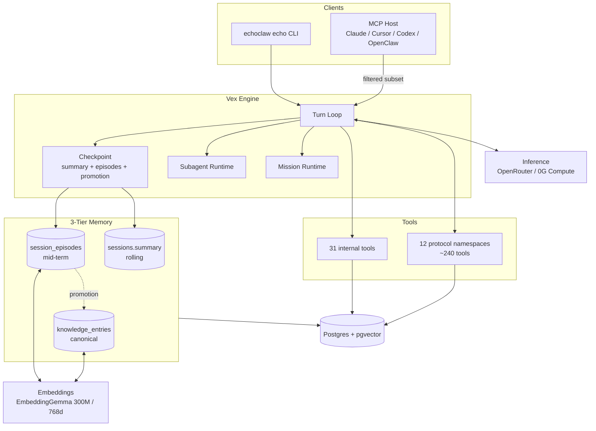

Every conversation — chat, mission, subagent, or MCP — is a row in `sessions` with its own message log, rolling summary, and `memory_scope_key`. The engine is a single turn loop with mode-specific behaviour; the rest is support infrastructure.

### Code roots

- `src/echo-agent/engine/` — turn loop, checkpoint, subagents, missions, prompt stack
- `src/echo-agent/tools/` — internal tools + protocol runtime + capture pipeline
- `src/echo-agent/knowledge/` — canonical memory layer + promotion orchestrator
- `src/echo-agent/db/` — 10 migrations, repos, pool singleton
- `src/echo-agent/sync/` — projections, FIFO lot matching, mark-to-market, balance sync
- `src/echo-agent/embeddings/` + `src/echo-agent/inference/` — network clients
- `src/mcp/` — production MCP server (`echoclaw-mcp`)
- `src/cli/` — `echoclaw echo` wizard + passthroughs
- `src/tools/` — 13 low-level SDK clients (khalani, kyberswap, jupiter, polymarket, jaine, slop, etc.)

---

# For developers

## Turn loop

The turn loop (`src/echo-agent/engine/core/turn-loop.ts`) drives every session kind. Each iteration: check abort → check runtime stop → execute one inference turn → dispatch any tool calls → deferred-save the canonical batch → run checkpoint if the session is under context pressure → continue or break.

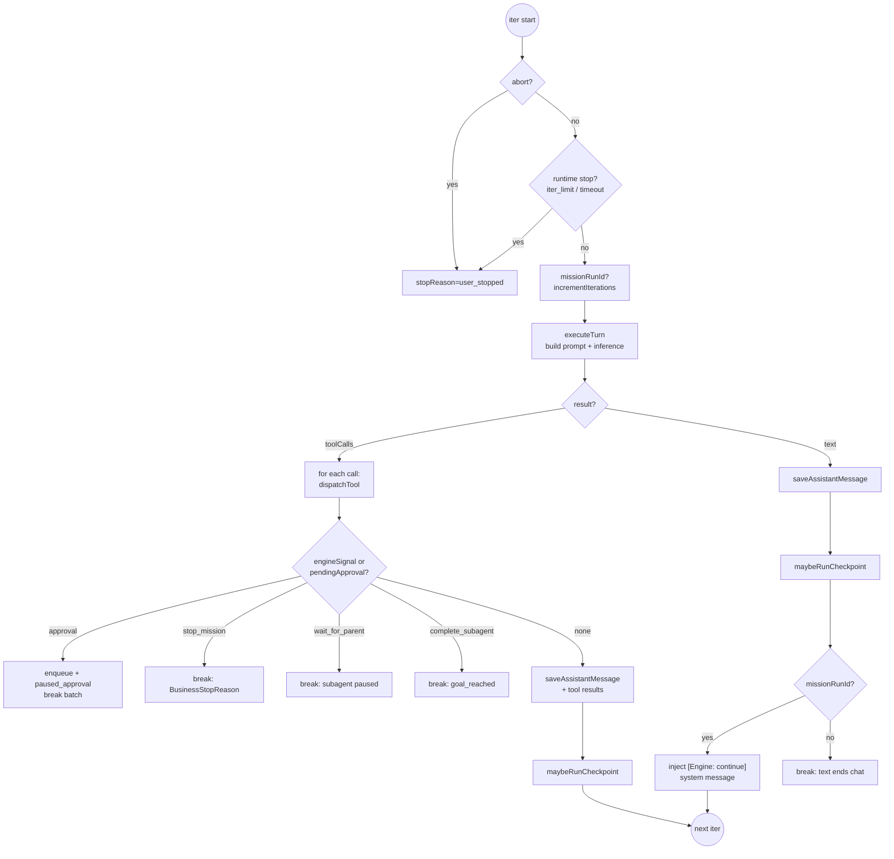

| Mode | Session kind | `missionRunId` | `maxIterations` | Text response behavior |
|---|---|---|---|---|
| Chat | `chat` | null | 1 | Ends loop |
| Mission setup | `mission` | null | 5 | Ends loop → `applyMissionPatch` |
| Mission run | `mission` | set | 50 | Injects `[Engine: continue]`, keeps looping |
| Subagent | inherited | null | `SUBAGENT_MAX_ITERATIONS` env | Same as chat unless engine signal fires |

**Deferred save invariant** — `executeTurn` does NOT save the assistant message. The turn loop collects dispatched tool calls and only saves the assistant row + tool results that actually entered dispatch. When an approval or engine signal interrupts mid-batch, the saved message reflects exactly what the next LLM turn will see.

**Stop reasons** (`src/echo-agent/engine/types.ts`) split into:
- **Business** (permanent): `goal_reached`, `deadline_reached`, `capital_depleted`, `max_loss_hit`, `no_viable_opportunity`, `user_stopped`.
- **Runtime** (resumable or fail): `approval_required`, `iteration_limit`, `timeout`, `waiting_for_parent`, `system_error`.

Business stops are triggered by the `mission_stop` internal tool emitting an `engineSignal` — never by parsing model prose.

## Sessions

A session is one conversational context with parent/child lineage. Every session carries:

- `scope` — coarse lifecycle tag (`chat` | `mcp` | `subagent` | …)
- `memory_scope_key` — semantic grouping key that episodes and recall operate on (independent of `sessionId`, so shared-scope subagents can contribute to parent recall)
- `memory_language_code` — inferred on first checkpoint, all summaries/episodes preserved in the user's language
- `summary` — rolling compaction of archived prefix
- `token_count` — latest prompt size; the single metric `CHECKPOINT_THRESHOLD` reads

`session_links` holds the canonical parent↔child graph used for subagents, schedulers, loops, and handoffs (`src/echo-agent/db/repos/session-links.ts`). `hydrateEngineSession` (`engine/core/hydrate.ts`) rebuilds the full `EngineContext` from DB on resume — including subagent-ness, active mission + run, and the scope key.

## Three-tier memory

Vex has three distinct memory surfaces, each with its own write + read path. Nothing is "the memory" — they cooperate.

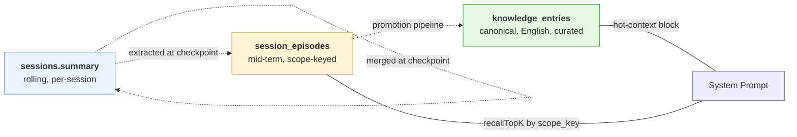

| Tier | Table | Lifespan | Write path | Read path |
|---|---|---|---|---|
| Rolling summary | `sessions.summary` | per session | `summarizePrefix` at checkpoint, merged (not replaced) with prior summary | Injected as `[Previous conversation summary]` system block |
| Session episodes | `session_episodes` | mid-term, scoped by `memory_scope_key` | `extractEpisodes` at checkpoint → `insertEpisodes` with per-row embedding | `recallTopK` at turn start — top 5, min similarity 0.25, query translated to English first |
| Knowledge entries | `knowledge_entries` | long-term, curated, English-normalized | Explicit `knowledge_write` / `knowledge_supersede` tools, or automatic promotion pipeline | Active Knowledge hot-context block + `knowledge_recall` tool |

**Scope key cascade** — a chat session uses `memory_scope_key = sessionId`. A subagent spawned as `scope_strategy: "shared"` inherits the parent's scope key so its checkpointed episodes land in the parent's recall pool. The default (`"isolated"`) gives the child its own scope so sibling subagents never bleed context. MCP sessions use `mcp-{transport}-{id}`.

**Episode kinds** (6): `decision | fact | preference | open_loop | tool_result_summary | lesson`.

**Multilingual-first** — session language is inferred on first checkpoint and persisted in `sessions.memory_language_code`. Summaries and all text-bearing episode JSONB fields (`facts`, `decisions`, `open_loops`, `tool_outcomes`, `entities`) stay in the source language. Only on promotion to canonical knowledge is content translated to English. Query translation runs at turn start before `embedQuery` so recall doesn't miss rows because the user spoke Polish.

## Checkpoint

The checkpoint keeps a session's context under the model limit while preserving semantic continuity. It fires when `sessions.token_count ≥ 0.9 × contextLimit`, uses three compaction modes, and always runs as a two-phase flow (remote LLM work outside any DB transaction, then one atomic commit).

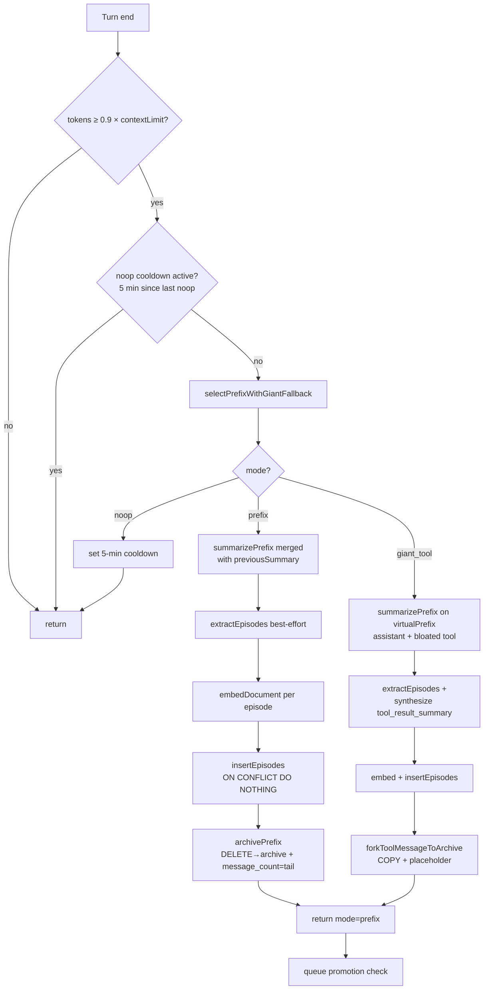

**Thresholds** (`src/echo-agent/engine/core/checkpoint.ts`, `engine/checkpoint/prefix.ts`):
- `CHECKPOINT_THRESHOLD = 0.9` — fire at 90% of context limit
- `TAIL_WINDOW = 10` — keep last 10 live messages after prefix archive
- `GIANT_TOOL_THRESHOLD = 8_000` — tool outputs >8KB trigger giant-tool fallback
- `NOOP_COOLDOWN_MS = 5 min` — don't retry compaction on an empty session

**Giant-tool mode** — triggered when a single bloated tool result is the sole source of pressure. The checkpoint COPIES the live row into archive (preserving the full payload), extracts a `tool_result_summary` episode pointing at the archived id, and replaces the live row's content with `[tool_result_summary#<id> — full payload archived at message_id=<mid>. Ask the operator for replay if needed.]`. The row stays live with the same id so `assistant.tool_calls ↔ role:'tool'` pairing doesn't break.

**Archive idempotency** — both archive inserts use `ON CONFLICT (id) DO NOTHING`, so giant-tool forks that later age into a normal prefix don't collide on the `LIKE INCLUDING INDEXES` unique index. `getAllMessages` prefers the archived canonical row over the live placeholder via `NOT EXISTS` in the UNION.

## Promotion pipeline

After every committed checkpoint the turn loop invokes `runPromotionForSession` (`src/echo-agent/knowledge/promotion.ts`). Mid-term episodes that are observed to recur graduate into canonical knowledge — permanent, cross-session, English-normalized.

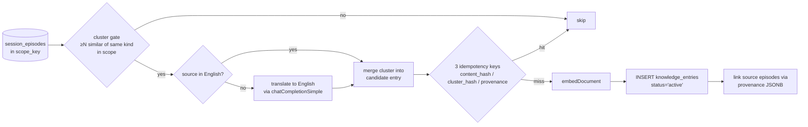

Key invariants:

- Fires **after** a committed checkpoint — never inside the checkpoint transaction. Remote LLM calls happen outside any DB tx.
- Cluster signal gates spam: a single lucky episode is not durable. Multiple similar episodes in the same `memory_scope_key` + `kind` is.
- Three independent dedupe keys prevent double-promotion on replay.
- Promotion is only text-translated to English; the source episodes stay in their native language.

## Subagents

A subagent is a child session with its own turn loop running fire-and-forget in the background. The parent dispatches `subagent_spawn` and gets an id back; status is polled via `subagent_status` or arrives via the parent-side message bus.

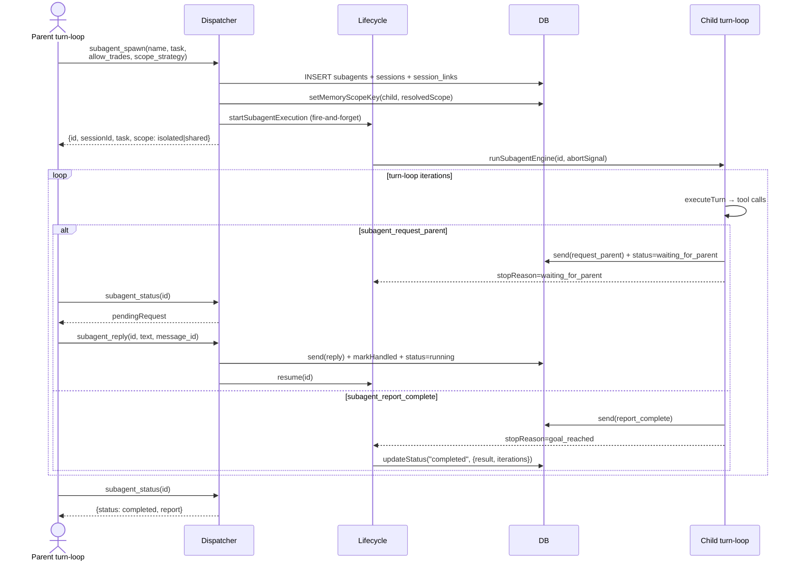

**Memory scope is a first-class spawn parameter** (`src/echo-agent/tools/internal/subagent/parent.ts:55`). Default `scope_strategy: "isolated"` gives the child its own `memory_scope_key` — no context bleed between sibling subagents running concurrently. Opt-in `"shared"` makes child checkpoints contribute to the parent's episode pool.

**Loop mode clamp** — `allow_trades=false` pins the child to `restricted` mode regardless of parent mode. A child never exceeds parent privilege.

**Role-based tool filter** — `subagent_spawn/status/stop/reply` are parent-only; `subagent_request_parent/report_complete` are child-only. Enforced via `excludeRoles` in the tool registry and hard-blocked at dispatch (`src/echo-agent/tools/dispatcher.ts`).

**Relay channel** — `subagent_messages` table carries `relay | request_parent | reply | report_complete`. Structured reports preserve evidence objects; plain relays are short text. The parent prompt carries a copied snapshot of the parent's rolling summary (copy-by-value to avoid drift).

## Missions

A mission is a pre-approved goal with a hard contract: allowed wallets/chains/protocols, capital source, success/stop criteria, risk profile. Setup is a guided conversational draft; run mode starts autonomous execution inside the turn loop.

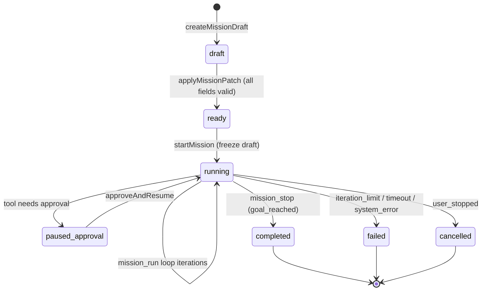

**Required mission fields** (`MISSION_DRAFT_REQUIRED_FIELDS`): title, goal, capitalSource, startingCapital, riskProfile, allowedWallets, allowedChains, allowedProtocols, successCriteria, stopConditions.

**Setup vs run is distinguished by `missionRunId`**, not `sessionKind`. Setup uses `sessionKind="mission"` with `missionRunId=null` (ends on text like chat). Run is `missionRunId!=null` (text never ends the loop; only `mission_stop` signal does).

**Frozen draft** — at `startMission` the current draft is snapshotted via `freezeDraft`; subsequent edits don't leak into the running loop.

**Approval queue lives out-of-band** — approvals are queued in `approval_queue`, not in the transcript. `approveAndResume` (`engine/core/resume.ts`) re-enters the loop after approval with `approved:true` context and replays the pending tool with saved args.

## Prompt stack

Every `executeTurn` composes the system prompt from a stack of labeled layers, joined by `\n\n---\n\n` (`src/echo-agent/engine/prompts/index.ts`):

```
CONSTANT:
  buildBasePrompt(context)        identity + date + session IDs + loaded docs
  activeKnowledgeBlock            pinned + recent knowledge + known kinds
  buildToolUsagePrompt()          discover/execute contract + memory policy
  buildProtocolsPrompt()          auto-gen from advertised namespaces (cached)

VARIABLE (per mode):
  buildModePrompt(loopMode)       off | restricted | full

CONTEXTUAL (per session kind):
  chat        → buildChatPrompt()
  mission     → buildMissionSetupPrompt(context, setupContext)
  mission-run → buildMissionRunPrompt(context, runContext)

OVERRIDE:
  isSubagent  → buildSubagentPrompt(context, subagentContext)

INJECTED AFTER SYSTEM PROMPT, BEFORE HISTORY:
  [Previous conversation summary]   if sessions.summary is non-null
  [Session episode recall]          top 5 matches from session_episodes
```

**Mode changes policy, not knowledge of protocols.** The protocols prompt is cached for the process lifetime — rebuilding it costs nothing in steady state. Active Knowledge and session-episode recall are pre-fetched in parallel (`Promise.all`) at the start of `executeTurn`; failures are non-fatal and just omit that block.

## Tools & protocols

Every LLM tool call goes through `dispatchTool` (`src/echo-agent/tools/dispatcher.ts`). Meta-tools `discover_tools` and `execute_tool` route to the protocol runtime. Everything else is either a role block or an internal tool — lazy-imported on demand through the table-driven `INTERNAL_TOOL_LOADERS`.

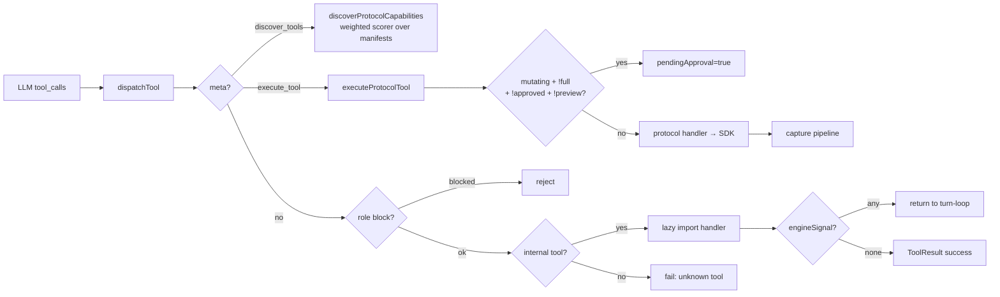

### Internal tools (31 total)

| Group | Count | Tools |
|---|---:|---|
| Protocol meta | 2 | `discover_tools`, `execute_tool` |
| Web | 2 | `web_search`, `web_fetch` |
| Documents | 4 | `document_read/write/list/delete` |
| Knowledge | 8 | `knowledge_write/recall/recall_overflow/get/update_status/supersede/lineage/history` |
| Scheduling | 2 | `schedule_create/remove` (NOT exposed to MCP) |
| Portfolio | 1 | `portfolio_inspect` (14-view DB reader) |
| Setup | 1 | `polymarket_setup` (auto-hidden once configured) |
| Mission | 1 | `mission_stop` (engine-signal channel) |
| Subagents | 6 | parent: `spawn/status/stop/reply`; child: `request_parent/report_complete` |
| EVM reads | 1 | `evm_read` (tx receipts / ERC20 metadata / balance) |
| Wallet | 3 | `wallet_read/send_prepare/send_confirm` (2-step approval) |

Adding an internal tool is a single row in `registry/<domain>.ts` + a loader entry in `dispatcher.ts`. `registry-completeness.test.ts` structurally asserts no orphans.

### Protocol namespaces (12, source of truth: `PROTOCOL_NAMESPACE_ALLOWLIST`)

| Namespace | Chain(s) | Purpose | Advertised |
|---|---|---|:-:|
| `khalani` | multichain (40+ EVM + Solana) | Cross-chain bridging + token registry + balances | ✓ |
| `kyberswap` | 20+ EVM chains | DEX aggregator: swaps, limit orders, zap LP, honeypot checks | ✓ |
| `solana` | Solana | Jupiter SDK: token search, swap, lend, prediction markets | ✓ |
| `polymarket` | Polygon | Prediction markets: gamma, CLOB, data, positions, bridge, rewards | ✓ |
| `jaine` | 0G EVM (16661) | 0G-native DEX: pools, swaps, w0G wrap/unwrap, allowances | ✓ |
| `slop` | 0G EVM | Bonding-curve token launchpad: create, trade, fees, rewards | ✓ |
| `slop-app` | off-chain REST | Slop.money social + agents + image generation | ✓ |
| `dexscreener` | multichain read | Price/liquidity/trending/CTO/boosts research | ✓ |
| `echobook` | off-chain REST | Social layer: feed, posts, comments, tradeproof, points | ✓ |
| `chainscan` | 0G EVM | 0G block explorer: account, tx, contract, token, stats | ✓ |
| `0g-compute` | — | Reserved (discovery-nav only, no manifest yet) | ✗ |
| `0g-storage` | — | Reserved (discovery-nav only, no manifest yet) | ✗ |

**~240 tools, zero prompt bloat** — protocol tools never enter the system prompt. The LLM calls `discover_tools(query)` first, gets a scored shortlist (weighted over `toolId`, descriptions, params, aliases, example intents, query coverage), then executes the chosen `toolId` via `execute_tool`. Result: 240 handlers cost 0 prompt tokens.

### EVM chain coverage (via `src/tools/khalani/chains.ts`)

40+ chains including: Ethereum, BSC, Polygon, Avalanche, Arbitrum, Base, Optimism, Scroll, Linea, zkSync Era, Mantle, Blast, Mode, Zora, Monad, Unichain, Sonic, Berachain, Abstract, Ink, Lens, Sei EVM, Story, Worldchain, Lisk, BoB, Redstone, Soneium, Gnosis, Cronos, Flow EVM, HyperEVM, Injective EVM, Jovay, Katana, Neon EVM, Plasma, Sophon, Zilliqa, Tron — and **0G mainnet (16661) as first-class home**.

## Protocol pipeline (capture → project)

Every mutating protocol call flows through a single audit → capture → projection pipeline so tool outputs become queryable truth with no handler-specific glue. Handlers don't touch the DB; they emit `_tradeCapture` and the pipeline does the rest in one transactional sweep.

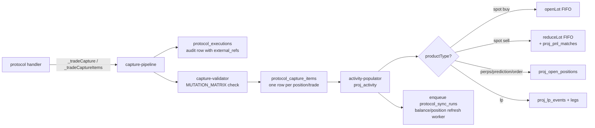

Validation is driven by `MUTATION_MATRIX` (`tools/protocols/mutation-matrix.ts`) — a structural contract for every mutating tool: required fields, valuation expectation, meta fields. Adding a new mutating protocol tool requires adding a matrix row; the pipeline refuses to write incomplete rows.

## LOT matching + PnL

Every successful spot mutation is normalized into `proj_activity`. **Buys open a FIFO lot**; **sells consume oldest lots** with SQL-side pro-rata cost basis, proceeds, and realized PnL. Perps and prediction markets use `proj_open_positions` with unrealized PnL via mark-to-market. Portfolio snapshots are a distinct time-series surface.

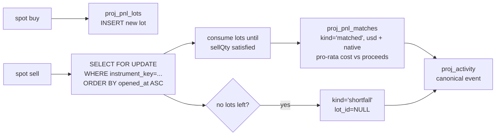

### PnL tables (all projections under `src/echo-agent/sync/`)

| Table | Purpose |
|---|---|
| `proj_activity` | Canonical normalized event feed — the spine. `input_value_usd`, `output_value_usd`, `unit_price_usd`, `valuation_source` |
| `proj_pnl_lots` | FIFO cost-basis ledger (one row per open lot) |
| `proj_pnl_matches` | Realized PnL ledger — `match_kind IN ('matched', 'shortfall')`, `lot_id` nullable on shortfall |
| `proj_open_positions` | Perps / prediction / order / LP lifecycle with `entry_price_usd`, `current_value_usd`, `unrealized_pnl_usd`, `notional_usd`, `fee_usd` |
| `proj_lp_events` + `proj_lp_event_legs` | Multi-token LP cashflow legs |
| `proj_balances` | Multi-chain token balances (source of portfolio value) |
| `proj_portfolio_snapshots` | Time-series portfolio USD + `pnl_vs_prev` |

**Cross-protocol lot matching** — lots are keyed by `instrumentKey` (e.g. `0g:{tokenAddress}`). A Slop bonding-curve buy and a Jaine AMM sell match the same lot chain; realized PnL posts correctly.

**All math in SQL.** Pro-rata calculations use `NUMERIC` throughout — no JavaScript float. `FOR UPDATE` locks lots for the duration of the sell. Shortfalls are recorded explicitly (missed inflow, transfer-in without history) rather than silently dropped.

**Read side** — `portfolio_inspect` exposes 14 views: `open_positions`, `activity`, `lots`, `profits`, `closed_positions`, `unrealized`, `bridges`, `lp_history`, `orders`, and more (`src/echo-agent/tools/internal/inspect-views/`).

## Approval gate & safety

Dangerous tools (swap, send, sign) are gated by **four independent layers**. A model that asks for a mutating call in the wrong context gets a `pendingApproval` response, never a silent execution.

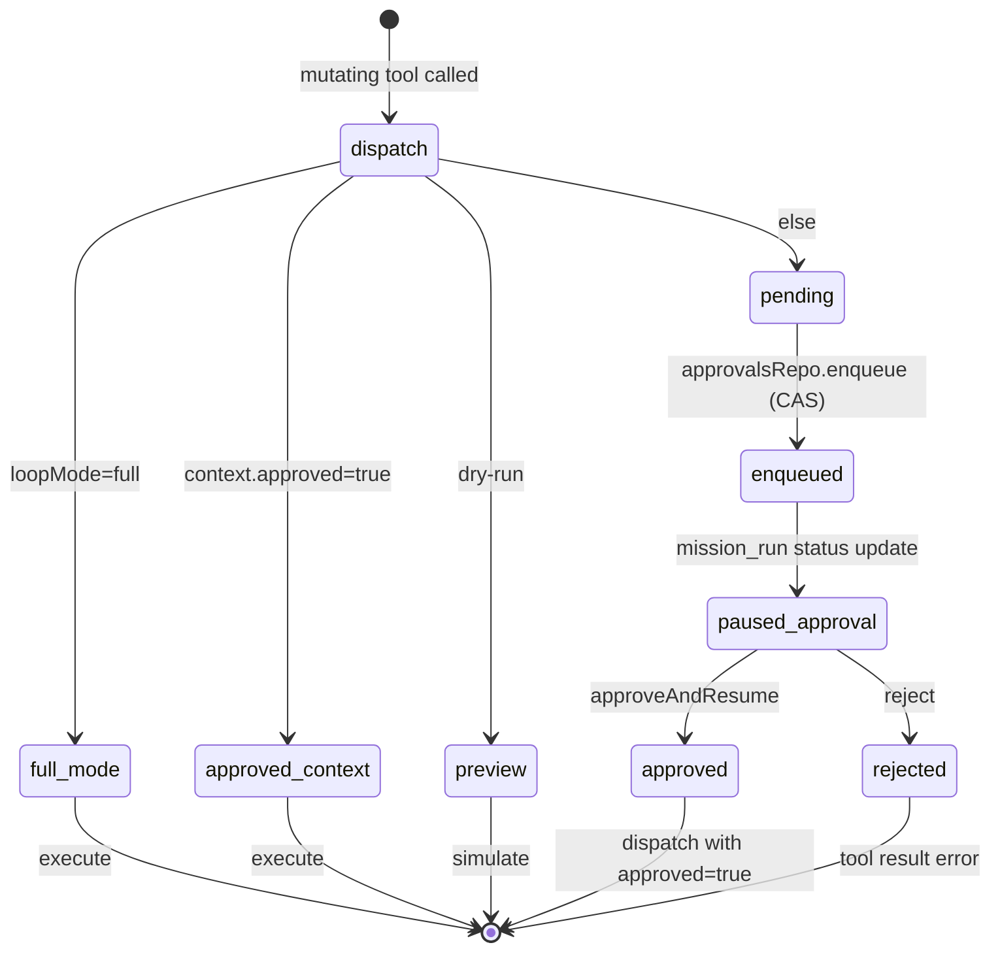

1. **Role** — `excludeRoles` on `ToolDef` (e.g. `subagent_reply` is parent-only, `subagent_report_complete` is child-only). Hard-blocked at dispatch.
2. **Mutating flag** — manifest declares `mutating: true`; the gate only triggers for these.
3. **Loop mode** — `off | restricted | full`. Only `full` bypasses approval for mutating tools. `off` forbids proactive tools entirely.
4. **Approval queue** — `approval_queue` row with atomic CAS (`WHERE status='pending'`) so a double-click can't double-execute.

Mission-level constraints live in the frozen draft: `allowed_protocols`, `allowed_chains`, `allowed_wallets`, `stop_conditions_json`, `success_criteria_json`, `risk_profile`. The only mutating *internal* tool is `wallet_send_confirm`; everything else on-chain goes through `execute_tool` + the capture pipeline.

## Inference

Two providers live side-by-side behind one `InferenceProvider` interface (`src/echo-agent/inference/types.ts`):

1. **`AGENT_PROVIDER`** env — explicit override, fail-fast on unknown value
2. **`OPENROUTER_API_KEY`** present → OpenRouter (SDK, streaming, tool calling)
3. **`compute-state.json`** exists → 0G Compute (raw HTTP, HMAC broker signing, on-chain ledger billing; no streaming)
4. Neither → refuse to start

Registry caches a singleton for the process lifetime (`src/echo-agent/inference/registry.ts`). Model is fixed per process via `AGENT_MODEL`; subagents have their own `SUBAGENT_*` envs but reuse the same provider instance.

```ts
interface InferenceProvider {
  readonly id: string;
  readonly displayName: string;
  loadConfig(): Promise<InferenceConfig | null>;
  chatCompletion(messages, tools, config): Promise<InferenceResponse>;
  chatCompletionSimple(messages, config): Promise<{ content, usage }>;
  chatCompletionStream(messages, tools, config): AsyncGenerator<StreamChunk>;
  getBalance(): Promise<ProviderBalance | null>;
  calculateCost(usage, config): RequestCost;
}
```

- `chatCompletion` = tool-calling round trip (300s timeout)
- `chatCompletionSimple` = summary / episode extraction / English translation (120s timeout)
- `chatCompletionStream` = UI chat (0G Compute returns a single chunk; non-streaming)

**Resilience** — 2 retries with exponential backoff + jitter. `isRetryableError` matches 5xx, 429, `ETIMEDOUT`, `ECONNRESET`, `ECONNREFUSED`. NOT retryable: `AbortError`, 4xx other than 429. Cost per request goes to `usage_log` with cached/reasoning token breakdown.

## Embeddings + Docker Model Runner

Embeddings are a separate concern with its own sidecar. The default is `ai/embeddinggemma:300M-Q8_0` (768-dim), pinned in the compose file and distributed under the [Gemma Terms of Use](https://ai.google.dev/gemma/terms) via Docker Hub. No HF token required.

`embedDocument(title, summary)` and `embedQuery(query)` use EmbeddingGemma-specific prefixes (`title: … | text: …` vs `task: search result | query: …`) — write and read paths deliberately differ per the model card. The **provider-reported model name** (not the requested one) is stamped on every row's `embedding_model` column and used as the recall filter — write and read paths must agree.

**Config-driven dim** — `EMBEDDING_DIM` is an env value; the schema's `vector` column has no typmod, so any positive dim in [1, 8192] is accepted. Model swaps are config changes + a re-embed (or export-wipe-import for different dims).

### Docker Desktop on WSL2 / host access

Docker Model Runner does **not** expose port `12434` on the host by default. To let the agent (running on the host) reach the embedding endpoint at `http://localhost:12434`:

1. **Docker Desktop → Settings → AI → AI**
2. Under **Docker Model Runner**:
   - Check **Enable Docker Model Runner**
   - Check **Enable host-side TCP support**
   - Set **Port** to `12434`
3. Click **Apply & restart**

Without this, `knowledge_write` / `knowledge_recall` fail with `embedding service unavailable: fetch failed`. (Linux docker engine users have no WSL layer — the compose `embeddings-proxy` sidecar handles internal routing.)

## MCP surface

`echoclaw-mcp` is a single binary with two transports selected by `--transport` flag or `MCP_TRANSPORT` env (default stdio):

- **stdio** — 1 process = 1 session. For Cursor / Claude Code / Codex.
- **streamable HTTP** — 1 HTTP session = 1 DB session (`mcp-http-{uuid}`). Loopback Fastify on 127.0.0.1:4203 by default.

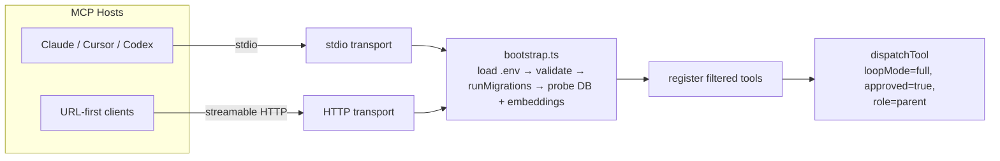

**Tool surface = filtered subset** via `getProductionMcpTools()`:

- Drop anything with `excludeFromMcp: true` (today: `schedule_create`, `schedule_remove`, `mission_stop` — echo-agent runtime concepts)
- Hard-drop any name starting with `subagent_` (defense in depth — subagents are an in-process feature)
- Honor `requiresEnv`, `showOnlyWhenEnvMissing`, `excludeRoles:['parent']`

Result: ~20 MCP tools (meta, web, document, knowledge, portfolio, setup, EVM, wallet). Each is registered individually on `McpServer` (no god-tool) via `registerProductionTools`.

**Boot sequence fails fast** (`src/mcp/bootstrap.ts`): load `.env` → validate 6 required env vars (DB URL + 4 embedding vars + Jupiter key) → `runMigrations()` additively → probe DB + embeddings → register tools. Any failure exits with code 2 and structured stderr.

**HTTP transport has three defense layers**: loopback bind (127.0.0.1), Host header allowlist (DNS rebinding protection), bearer token from `CONFIG_DIR/mcp-http-token` (mode 0600, autogenerated on first run).

**The MCP server is a passive bridge** — it uses the canonical `dispatchTool` with `approved: true`. The gate for mutations is the MCP host's own permission UX, never a second EchoClaw approval flow.

## Database schema

Single Postgres instance reached via `ECHO_AGENT_DB_URL`. Schema is applied by an idempotent migration runner over 10 SQL files (`001_initial.sql` → `010_episode_promotion.sql`). Clean-slate design — no legacy path.

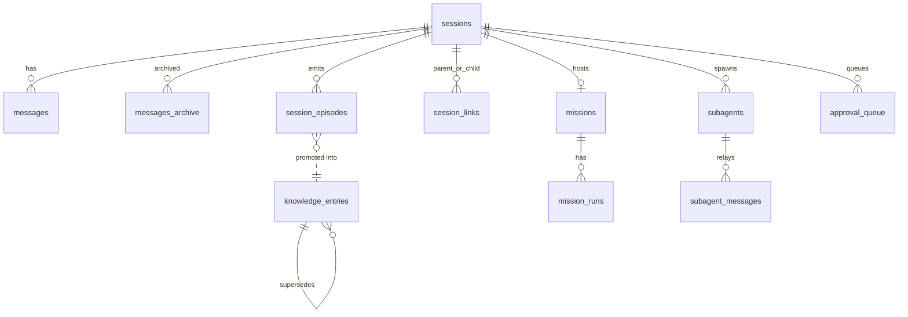

### Tables grouped

- **Identity** — `schema_version`, `soul`
- **Sessions + messages** — `sessions`, `messages`, `messages_archive`, `session_links`, `session_episodes`, `subagents`, `subagent_messages`
- **Knowledge** — `knowledge_entries`, `documents`, `folders`, `recall_cache_entries`
- **Missions** — `missions`, `mission_runs`
- **Protocol sync** — `protocol_executions`, `protocol_capture_items`, `protocol_sync_jobs`, `protocol_sync_runs`
- **PnL / projections** — `proj_activity`, `proj_balances`, `proj_open_positions`, `proj_pnl_lots`, `proj_pnl_matches`, `proj_portfolio_snapshots`, `proj_lp_events`, `proj_lp_event_legs`
- **Runtime** — `runtime_state`, `runtime_cycles`, `schedules`, `schedule_runs`, `maintenance_leases`, `inbox_events`
- **Caches** — `fetch_cache`, `search_cache`
- **Approvals / usage** — `approval_queue`, `usage_log`, `billing_snapshots`

### Load-bearing invariants

- **pgvector typmod contract** — `knowledge_entries.embedding` and `session_episodes.embedding` are `vector NOT NULL` with NO typmod. Per-row `embedding_model + embedding_dim` authoritative; recall MUST filter on both (mixed-dim `<=>` crashes pgvector).
- **messages ↔ messages_archive column parity** — `archivePrefix` does `DELETE ... RETURNING *` → `INSERT INTO messages_archive SELECT *`. Every ALTER on `messages` must mirror on `messages_archive`.
- **content_hash idempotency** — `knowledge_entries.content_hash CHAR(64)` UNIQUE. `insertEntry` uses `ON CONFLICT (content_hash) DO NOTHING`.
- **Partial unique indexes** — single-successor lineage, episode dedupe. `ON CONFLICT` clauses MUST mirror the partial predicate.
- **maintenance_leases** — reembed/import scripts take a named lease to keep the loop engine out of their way.

## Switching embedding model

The schema does NOT lock the vector dimension. `EMBEDDING_MODEL` and `EMBEDDING_DIM` are config values; the response length is stamped on each row's audit columns and recall filters on `embedding_model + embedding_dim`.

Maintenance commands require an explicit `ECHO_AGENT_DB_URL` — they refuse to fall back to a dev database to prevent data-loss on the wrong DB. Source the env once:

```bash
set -a; . docker/echo-agent/.env; set +a
```

### Same-dim swap (e.g. Gemma 300M Q8 → Gemma 300M Q4, both 768)

```bash
# 1. Stop all writers (loop engine, MCP server, subagents, any CLI session).
# 2. Update EMBEDDING_MODEL in .env and re-source.
# 3. Re-embed in place. Script refuses to run if any row has a different
#    embedding_dim or if runtime_state.active = TRUE.
pnpm knowledge-reembed
# 4. Restart the agent.
```

### Different-dim swap (e.g. Gemma 768 → Qwen3 1024)

```bash
# 1. Export (read-only, works even if current model is broken).
pnpm knowledge-export -- --out ~/echoclaw-knowledge-$(date +%Y%m%d).jsonl

# 2. Stop agent, wipe dev DB volume.
docker compose -f docker/echo-agent/docker-compose.dev.yml down -v

# 3. Update EMBEDDING_MODEL, EMBEDDING_DIM in .env and re-source.

# 4. Recreate stack — schema applies fresh.
docker compose -f docker/echo-agent/docker-compose.dev.yml up -d

# 5. Restore. Each entry is re-embedded locally with the new model. Audit
#    fields survive the roundtrip; idempotent on content_hash.
pnpm knowledge-import -- --in ~/echoclaw-knowledge-...jsonl
```

## Roadmap / known gaps

Things deliberately not in the current release, with file pointers. This is what Vex does NOT pretend to have:

- **Pluggable embedding prompt formatters** — the `title: … | text: …` and `task: search result | query: …` prefixes are Gemma-specific. Switching to BGE / E5 / Qwen3 / nomic requires a per-model formatter (`src/echo-agent/embeddings/client.ts`).
- **MCP stdio orphan session cleanup** — if the host crashes before `onclose` fires, the `sessions` row is left with `ended_at IS NULL`. Cleanup job is a follow-up (`src/mcp/sessions.ts`).
- **Native-token gas reserve guard** — transfers that spend native gas don't yet have a runtime guard to keep a minimum balance (`src/echo-agent/tools/protocols/handler-helpers.ts`).
- **Khalani Solana TRANSFER deposits** — not implemented in this release (`src/tools/khalani/bridge-executor.ts`).
- **pgvector ANN index** — exact cosine scan is fine up to ~5k entries. Enabling `ivfflat` / `hnsw` requires typing the vector column, which breaks the typmod-free contract.
- **`echoclaw vex` runtime** — CLI stub reserved for a future standalone VEX shell (`src/cli/vex/index.ts`).
- **`0g-compute` / `0g-storage` namespaces** — allowlisted for discovery-navigation metadata, manifests pending (`src/echo-agent/tools/protocols/catalog.ts`).
- **`chatCompletionStream` on 0G Compute** — the broker doesn't stream; a single chunk is returned.
- **`paused_checkpoint` mission state** — enum scaffold for a future pause-on-checkpoint UX; not emitted yet (`src/echo-agent/engine/types.ts`).

## Structure

```
src/echo-agent/
  engine/
    core/        Turn loop, turn execution, hydrate, resume, runner, checkpoint entrypoint
    checkpoint/  Prefix selection, merge (rolling summary), extract (episodes)
    prompts/     Base, mode, chat, mission-setup, mission-run, subagent, protocols, knowledge, session-memory
    subagents/   Runner, relay
    mission/     Setup, validator, mapper, patch-parser
  knowledge/     Promotion orchestrator, content-hash, policy, ranking, recall-payload
  tools/
    internal/    29 tools (knowledge, subagent, mission, wallet, evm, document, web, portfolio, schedule)
    protocols/   12 namespaces, ~240 toolIds, dispatcher + capture pipeline + discovery scorer
    registry.ts  Tool registration + role + env filters
    dispatcher.ts
  db/
    migrations/  001–010 SQL
    repos/       Sessions, messages, session-episodes, knowledge/*, missions, mission-runs, approvals, usage, pnl-lots, pnl-matches, session-links
    client.ts    Pool singleton
    migrate.ts   Idempotent migration runner
  sync/          FIFO lot projector, balance/position sync, MTM, LP economics, prediction settlement, replay
  embeddings/    EmbeddingGemma client + config + resilience
  inference/     OpenRouter + 0G Compute + registry + resilience

src/tools/       13 SDK directories (khalani, kyberswap, jupiter, polymarket, jaine, slop, chainscan,
                 dexscreener, echobook, 0g-compute, 0g-storage, wallet, slop-app)
src/mcp/         Production MCP server (echoclaw-mcp) — bootstrap, sessions, surface/tool-bridge, transports
src/cli/         echoclaw CLI (echo wizard, mcp passthrough, vex stub)
src/config/      App config + OS-appropriate paths
src/constants/   0G chain + Jaine + Slop contract addresses
src/utils/       Shared utilities (logger, http, dotenv, rate limiting, validation, package-assets)
src/errors.ts    Error codes and types
```

## Requirements

- Node **≥22**
- pnpm **10+**
- Docker Engine
- Docker Compose **≥2.38.1** (for the `models:` block)
- Docker Model Runner active (`docker model status` should be green)
- Docker Desktop **Settings → AI → AI → Enable host-side TCP support** on port `12434` (WSL2 / host access)

## License

See `LICENSE`.
